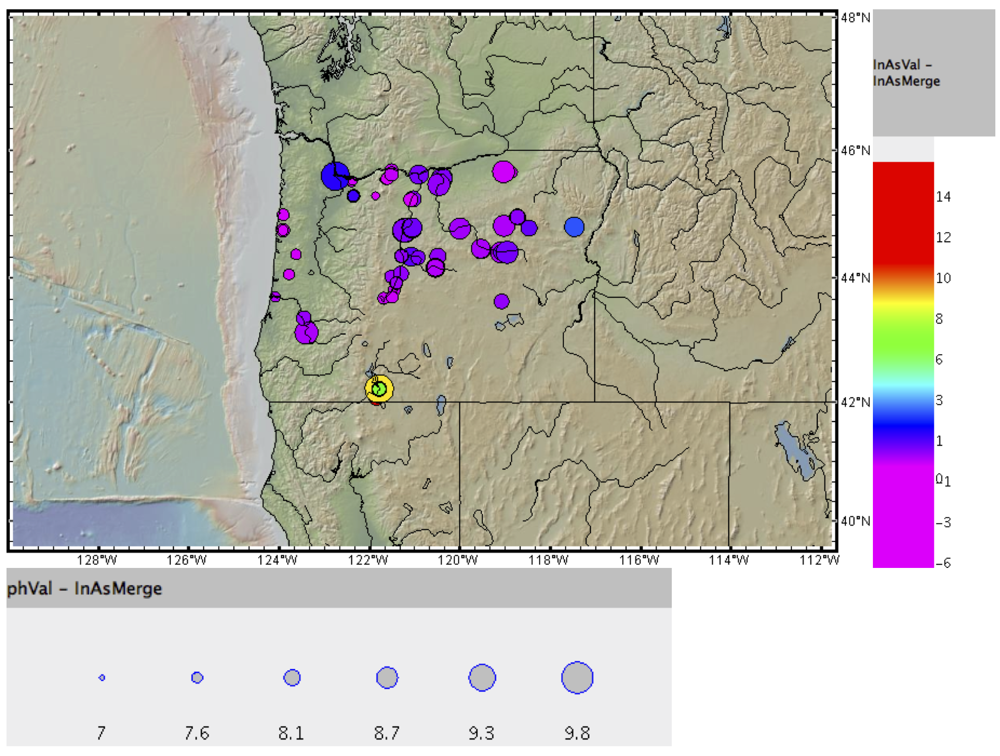

# Investigating the association between groundwater arsenic concentrations and water pH

Final project for Columbia University Research Computing in Earch Sciences course (EESCGR6901).

Description of project, code, and results are found in the FinalProject_Bozack.ipynb file.

## Background
Arsenic exposure through drinking water is a major public health concern. Over 200 million people worldwide are exposed to arsenic concentration in drinking exceeding the WHO guideline of 10 $\mu$g/L.1 Arsenic is a group 1 human carcinogen and exposure affects all organ systems. Groundwater arsenic concentrations are influenced by pH: basic water nuetralizes soil ion exchange sites, therefore releasing arsenicals.2
1 Naujokas, et al. Environ Health Perspect. 2013;121:295-302. 2 https://umaine.edu/arsenic/how-does-arsenic-get-into-the-groundwater/

## Objective
The objective of this project is to investigate the association between groundwater arsenic concentrations and water pH in the United States.

## Overview of methods
* Datasets on sampling sites, water inorganic arsenic concentrations, and water pH were downloaded from the Nation Water Quality Monitoring Council at https://www.waterqualitydata.us/portal/
* Preliminary data cleaning was performed using Unix (e.g., removing unnecessary columns in the datasets).
* Using python, datasets were merged on location ID and month and year of sample collection.
* The association between water arsenic concentrtrations and pH were assessed using Pearson correlations and regression.
* Results were mapped using GeoMapApp.

## Summary of results
* Inorganic arsenic concentration and pH data matched on location, year, and month were only available for Oregon, and therefore analyses of association were restricted to this state.
* log(mean inorganic arsenic concentration) was positively associated with pH: $\rho$=0.60; P=2.314x10-06

